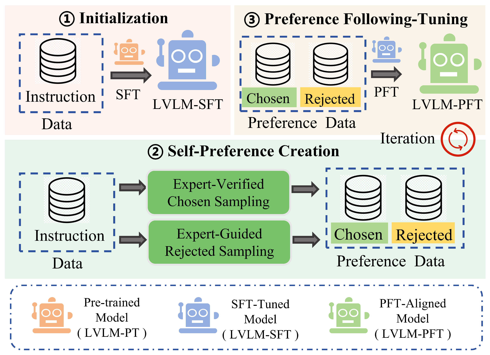

#  EAGLE: Expert‑Guided Self‑Enhancement for Preference Alignment in Pathology Large Vision‑Language Models

[📄 ACL 2025 Paper](https://aclanthology.org/2025.acl-long.711.pdf)


**EAGLE** is a three-stage alignment framework designed to enhance Large Vision-Language Models (LVLMs) in pathology by leveraging expert-guided self-enhancement and preference data.

---

## 🔍 Overview

### 1. Supervised Fine-Tuning (SFT)
- Fine-tune a base LVLM (e.g., Vicuna + QuiltNet) using pathology-specific instruction data.

### 2. Self-Preference Creation
Generate preference data **without human annotation**, through:
- **Chosen Sampling**: Prompted outputs guided by expert knowledge.
- **Rejected Sampling**: Created by controlled corruptions, including:
  - **Entity Replacement**: Using medical Named Entity Recognition (NER).
  - **Visual Masking**: Deliberate mislocalization or occlusion of critical image regions.

### 3. Preference-Following Tuning (PFT)
- Apply **Direct Preference Optimization (DPO)** to:
  - Reward preferred (chosen) outputs.
  - Penalize corrupted (rejected) outputs.
- Support **multi-round tuning** for iterative refinement.

---

## 💡 Key Contributions
- Introduces a **scalable, expert-guided self-enhancement** pipeline.
- Builds **pathology-specific preference pairs** with minimal human cost.
- Improves **faithfulness, factual accuracy, and localization ability** in pathology VQA tasks.

---

### Installation

1. **Clone repository & enter directory**
    ```bash
    git clone https://github.com/meidandz/EAGLE.git
    cd EAGLE
    ```

2. **Create and activate Python virtual environment**
    ```bash
    conda create -n eagle python=3.10 -y
    conda activate eagle
    ```

3. **Install package**
    ```bash
    pip install --upgrade pip  # upgrade pip for best compatibility
    pip install -e .
    ```

4. **(Optional) Install training dependencies**
    ```bash
    pip install -e ".[train]"
    pip install flash-attn --no-build-isolation
    ```


## 📎 Citation

```bibtex
@inproceedings{ding2025eagle,
  title={EAGLE: Expert-Guided Self-Enhancement for Preference Alignment in Pathology Large Vision-Language Model},
  author={Ding, Meidan and Zhang, Jipeng and Wang, Wenxuan and Zhong, Haiqin and Wang, Xiaoqin and Lyu, Xinheng and Chen, Wenting and Shen, Linlin},
  booktitle={Proceedings of the 63rd Annual Meeting of the Association for Computational Linguistics (Volume 1: Long Papers)},
  pages={14603--14619},
  year={2025}
}
